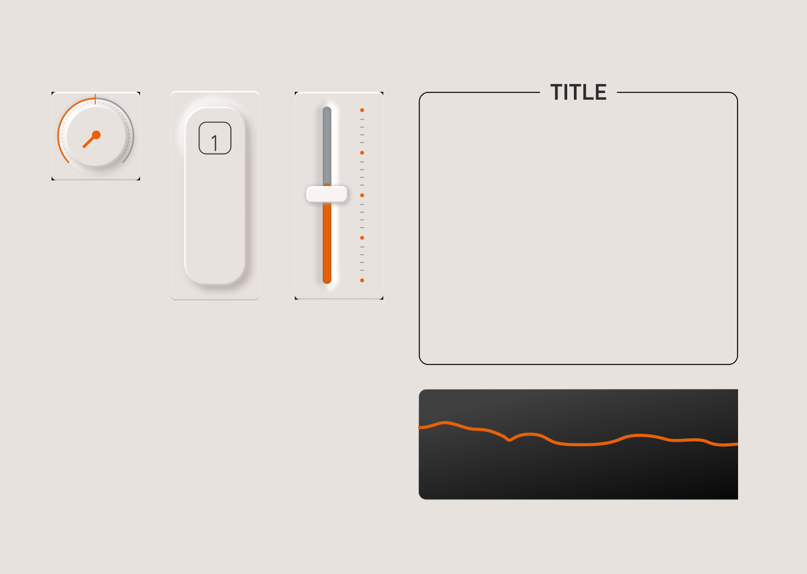
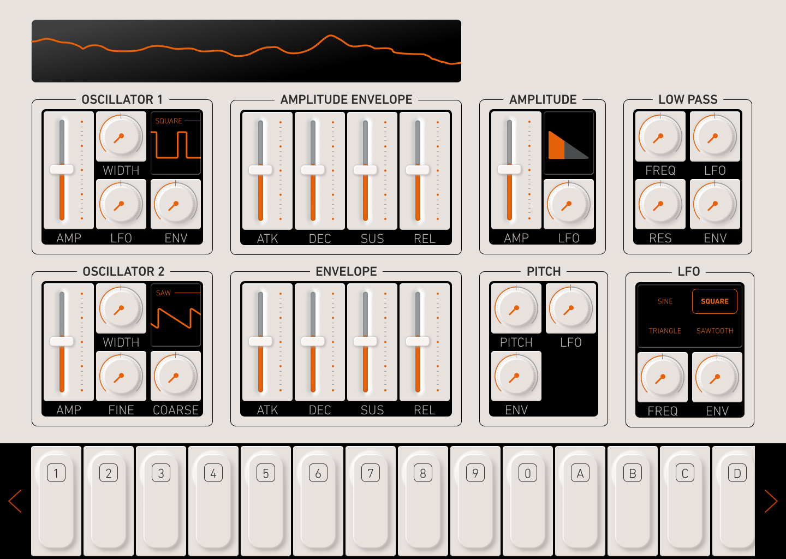
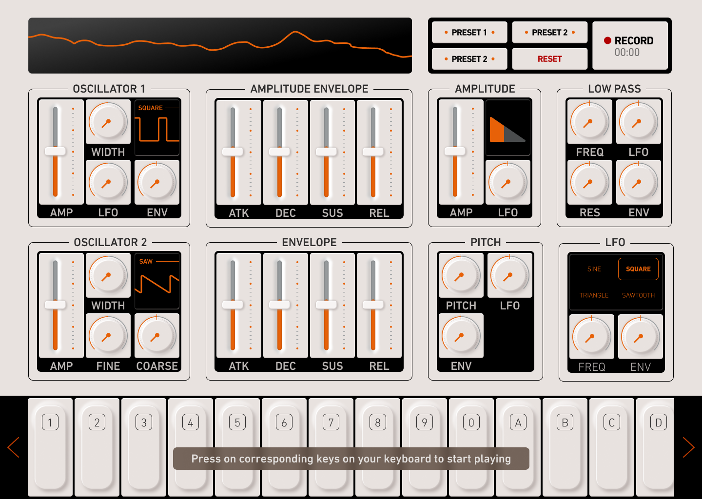
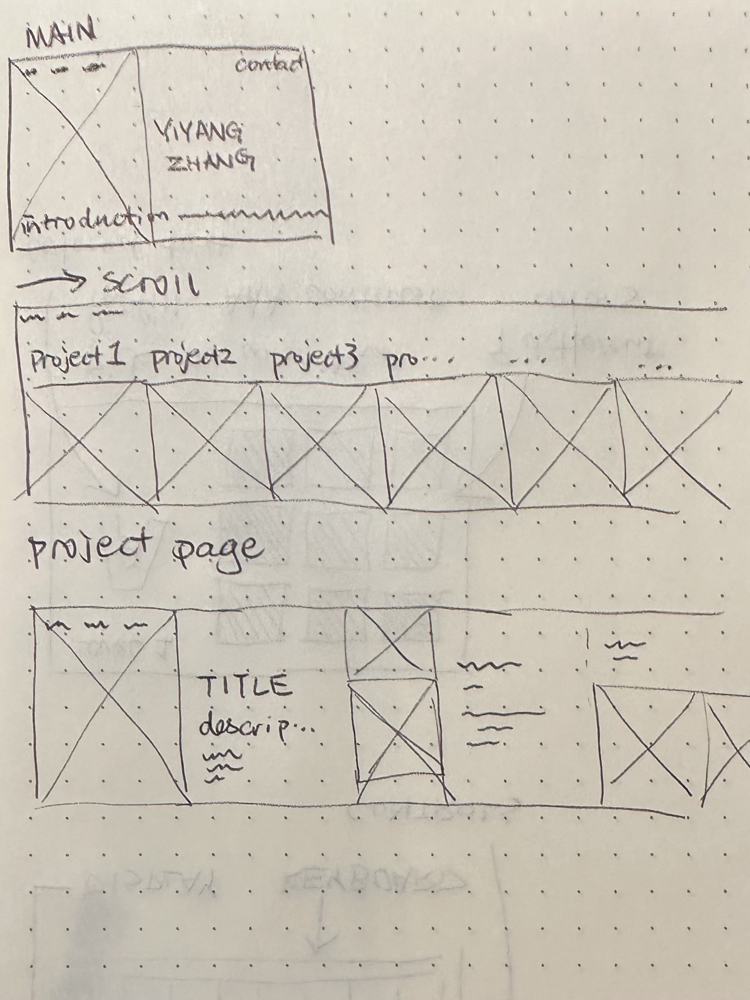
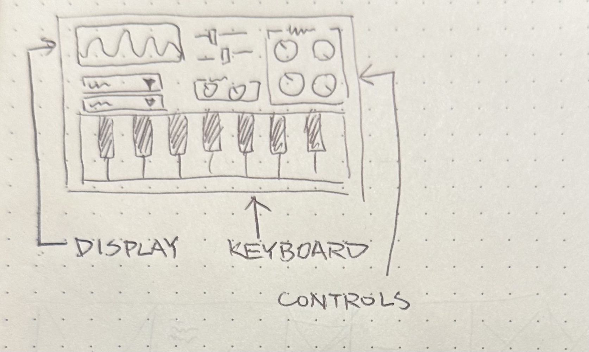
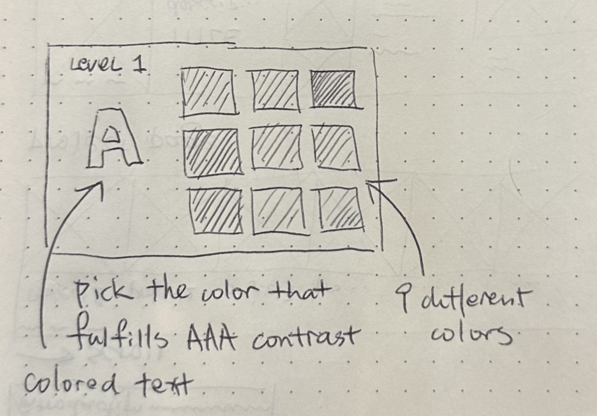

<mark>**Note that this document order from FP4 -> FP1**</mark>

<mark>Please sign up for the study</mark> at [https://tinyurl.com/pui-study](https://tinyurl.com/pui-study) to allow us to use your submission to create a better GenAI assistant for designers!

---

# **FP4 \- Final Project Writeup**

Feel free to refer to this [Markdown Cheat Sheet](https://www.markdownguide.org/cheat-sheet/) to make your writeup more organized, and you can preview your markdown file in VSCode [Markdown editing with Visual Studio Code](https://code.visualstudio.com/docs/languages/markdown#_markdown-preview).

## Part 1: Website Description

TONE V5.0 is a web-based synthesizer application that allows users to create and manipulate digital music through an interactive interface. The application combines visual design elements reminiscent of vintage synthesizers with modern web technologies, creating a unique digital music-making experience.

## Target Audience

The website targets:

- Music enthusiasts interested in digital sound synthesis
- Web developers exploring audio applications
- Digital artists looking for creative tools
- Beginners interested in learning about sound synthesis

## Information & Features

The application provides:

- Real-time sound synthesis controls
- Visual feedback through a visualization container
- Sequencer functionality for creating musical patterns
- Educational content through a manual/tutorial section

## Engaging Elements

### Visual Design

The interface features a retro-inspired design with careful attention to detail, including:

- Inset shadows and gradient effects
- Decorative screws and modular components
- A vintage monitor-style layout

### Interactive Elements

- Real-time visual feedback through canvas visualization
- Tab-based navigation for different functions
- Interactive keyboard interface
- Sequencer for pattern creation

### Accessibility

The application maintains accessibility through:

- Screen reader support with sr-only classes
- Clear visual hierarchy
- Consistent navigation patterns
- Responsive design considerations

## Part 2: User Interaction

1. **Initial Audio Setup**

- Click anywhere on the main page to initialize Web Audio
  _note that console error when initializing is normal. This is a tradeoff between usability ("invisible"initializing on click vs clicking a button every refresh)_
- Audio engine starts and synthesizer becomes playable

2. **Basic Sound Generation**

- Press keyboard keys A-L to play white notes
- Press keyboard keys Q-P to play black notes
- Press number keys 1-4 to trigger drum sounds
- Click virtual keyboard on screen to play notes with mouse

3. **Sound Shaping**

- Click "DESIGN" tab to access sound controls
- Adjust oscillator sliders to change sound character:
  - Move Mix slider to blend between oscillators
  - Move Detune slider to create width/detuning effect
  - Move Filter Cutoff to change brightness
  - Move Resonance to add emphasis

4. **Pattern Creation**

- Click "COMPOSE" tab to access sequencer
- Press spacebar or click Play button to start/stop sequence
- Click on sequence steps to select them
- Play notes to record into selected steps
- Click recorded notes to delete them
- Click BPM +/- buttons to adjust tempo

5. **Sound Visualization**

- Observe top display panels showing:
  - Real-time waveform visualization
  - Frequency spectrum
  - ADSR envelope shape

6. **Pattern Modification**

- Click Reverse button to play sequence backwards
- Click Preset button to cycle through drum patterns
- Hold Shift while playing notes to record to multiple steps
- Double-click keys for "sticky" note behavior

7. **Navigation**

- Click nav buttons to move between:
  - Main studio interface
  - Tutorial/manual page
  - About page

## Part 3: External Tool

**Tone.js**

- Chosen for its audio synthesis capabilities and abstraction of Web Audio API complexities into a more intuitive interface. Its modular design and comprehensive documentation make it ideal for building synthesizers.
- Used to create oscillators, filters, effects chain, and handle all audio processing and routing in the synthesizer. The library manages audio timing, synthesis, and sequencing.

**Web Audio API**

- Native browser API that provides low-level audio processing capabilities with minimal latency. Direct browser support means no additional dependencies for core audio functionality.
- Used as the foundation for audio processing, with Tone.js building upon it for higher-level features. Handles audio context initialization and real-time audio processing.

**Canvas API**

- Native HTML5 API chosen for its efficient rendering capabilities and broad browser support. Perfect for real-time visualization without requiring external libraries.
- Used to create real-time visualizations of waveforms, frequency spectrum, and envelope shapes. Updates the display 60 times per second to show current audio state.

## Part 4: Design Iteration

**V1-3**
v1 to v3 of Tone was using the web audio api directly, which was a bit of a challenge since it was a bit more difficult to implement.

**v4**
Starting from v4, I used Tone.js to abstract the web audio api, which made the implementation much easier and more intuitive.

**v5**
Starting from v5, I added the sequencer to the synthesizer, which was a bit of a challenge since it was a bit more difficult to implement. However, the rationale behind this is to make the synthesizer more engaging, useful, and educational, as well as to demonstrate the capabilities of the synthesizer.

## Part 5: Implementation Challenge

The biggest challenge was handling audio timing and synchronization, particularly coordinating the sequencer playback with visual updates and ensuring consistent timing across different browsers. Another significant challenge was managing state across multiple modules (audio engine, sequencer, keyboard) while keeping the code organized and maintainable, especially when implementing features like pattern recording and preset management.

## Part 6: Generative AI Use and Reflection

Describe how you used Generative AI tools to create this final project (fill in the following information, write \~500 words in total).

Document your use of all GenAI tools — ChatGPT, Copilot, Claude, Cursor, etc. using the template below. Add/Delete rows or bullet points if needed, and replace Tool1/Tool2 with the name of the tool.

### Usage Experiences by Project Aspects

Feel free to edit the column \_ (other?) or add more columns if there's any other aspect in your project you've used the GenAI tools for.

For the following aspects of your project, edit the corresponding table cell to answer:

- _Usage_: Whether you used / did not use this tool for the aspect. Enter [Yes/No]
- _Productivity_: Give a rating on whether this tool makes your productivity for X aspect [1-Much Reduced, 2-Reduced, 3-Slightly Reduced, 4-Not Reduced nor Improved, 5-Slightly Improved, 6-Improved, 7-Much Improved].

| Tool Name | Ratings      | design | plan | write code | debug | copywriting |
| :-------- | :----------- | :----- | :--- | :--------- | :---- | :---------- |
| ChatGPT   | Usage        | No     | Yes  | No         | Yes   | Yes         |
| ChatGPT   | Productivity | N/A    | 6    | N/A        | 3     | 7           |

### Usage Reflection

> Impact on your design and plan

- It matched my expectations and plan in [FP2](#generative-ai-use-plan) in that … For example,
  1. ChatGPT was able to help me with basic tasks like copywriting and debugging, which was helpful; though when it comes to more complex tasks, it was not able to help me as much and even dragged me in the wrong direction so I stopped using it for that purpose.
- It did not match my expectations and plan in [FP2](#generative-ai-use-plan) in that … For example,
  1. I did not end up using Github Copilot since I found it to be more of a distraction than a help.
- GenAI tool did/did not influence my final design and implementation plan because … For example,
  1. My design was not influenced by the tool since I already had a plan in mind and the tool was not able to help me with that. In addition, my design not as generic in a way that it was not able to be easily implemented by Gen AI.

> Use patterns

- I accepted the generations when … For example,
  1. ChatGPT: For generic copywriting and debugging CSS, I mostly accepted the generations.
- I critiqued/evaluated the generated suggestions by … For example,
  1. ChatGPT: ChatGPT sometimes suggested implementations without considering the actual context of the project, which was a bit of a distraction.

> Pros and cons of using GenAI tools

- Pros
  1. ChatGPT: Significantly reducing time spent on "busy work" like copywriting and syntax error.
- Cons
  1. ChatGPT: Sometimes code is wrong and it takes much longer to debug than writing it myself.

### Usage Log

Document the usage logs (prompts and chat history links) for the GenAI tools you used. Some tools may not have an easy way to share usage logs, just try your best! Some instructions for different tools:

1. [ChatGPT](https://help.openai.com/en/articles/7925741-chatgpt-shared-links-faq)
   [chat log](https://chatgpt.com/share/6756718d-c3ac-8013-9851-c898fda94bf4)

---

# **FP3 \- Final Project Check-in**

Document the changes and progress of your project. How have you followed or changed your implementation & GenAI use plan and why? Remember to commit your code to save your progress.

## Implementation Plan Updates

- [ ] ...

## Generative AI Use Plan Updates

- [ ] ...

Remember to keep track of your prompts and usage for [FP4 writeup](#part-6-generative-ai-use-and-reflection).

---

# **FP2 \- Evaluation of the Final project**

## Project Description

This project is a web-based synthesizer interface that allows users to experiment with sound generation and modulation through an intuitive, interactive layout. My motivation is to create a visually engaging, functional synthesizer that mimics the look and feel of physical synthesizers, enabling users to manipulate sound parameters directly on screen.

## High-Fi Prototypes

### _Prototype 1_

Prototype 1 focuses on the individual interface elements I plan to use in the synthesizer, including sliders, knobs, screens, graphics, and keys. These components establish the essential controls that users will interact with to adjust sound parameters. Initial feedback emphasized the importance of making each element responsive and visually intuitive to enhance usability, as well as some issues with accessibility.

### _Prototype 2_

Prototype 2 shows how the elements from Prototype 1 can come together into a cohesive interface. This mockup demonstrates a possible layout, showing how controls like oscillators, envelopes, and filters are organized. Feedback on this prototype suggested refining the layout for clarity and ease of use, as well as adding visual indicators for how to start using these controls, possible presets, etc.

## Usability Test

During usability testing, users appreciated the overall layout but suggested that certain controls, particularly sliders and buttons, could be more responsive and precise. Improving the visual feedback when adjusting parameters like oscillators and filters, to make it clearer which settings are active.

Some users found it challenging to distinguish between the effects of different controls, indicating that clearer labeling or tooltips could improve usability. Additionally, users proposed adding a feature that shows a visual waveform in real-time, which I have already added in the prototype above since this feedback came before that, to help them understand how their adjustments impact sound.

## Updated Designs

The updated design included some presets where user can simply click on a button and experience the change in sound, as well as a reset button to put everything back to default. A recording functionality is in consideration given the feedback, though actual implementation might differ depending on the complexity & if an export need to be included with this feature.
This update also included a pop-up tooltip to inform users of the keybaord control feature.
Smaller updates also include a bolder font size overall, and slight adjustments to the color, though the color palette still needs refinement to align with accessibility standards.

## Feedback Summary

In the lab session, feedback focused on making the interface more accessible and intuitive, particularly by improving the slider and button responses. People said that the visual feedback for active controls made the synthesizer more engaging and easier to use. Some suggestions involved further refining the control layout for different screen sizes to ensure that the synthesizer remains usable on various devices, as well as possibilities to make it even simpler to cater to a wider audience.

## Milestones

### _Implementation Plan_

- [x] **Week 9 Oct 28 - Nov 1**:
  - [x] FP1 due
  - [x] Complete Hi-Fi prototype 1 usability testing and iterate based on feedback.
- [x] **Week 10 Nov 4 - Nov 8**:
  - [x] FP2 due
  - [x] Begin final design adjustments and integrate visual feedback enhancements.
- [ ] **Week 11 Nov 11 - Nov 15**:
  - [ ] Implement responsive design elements for different screen sizes.
  - [ ] Refine the interaction for sliders and buttons.
- [ ] **Week 12 Nov 18 - Nov 22**:
  - [ ] Finalize integration of visual waveform display.
  - [ ] Conduct additional usability tests for refined interactions.
- [ ] **Week 13 Nov 25 - Nov 29**:
  - [ ] Thanksgiving break; refine documentation and gather final feedback.
- [ ] **Week 14 Dec 2 - Dec 6**:
  - [ ] FP4 due
  - [ ] Final testing and debugging before project presentation.

### _Libraries and Other Components_

- **Tone.js**: For audio synthesis and sound manipulation.
- **Anime.js**: For smooth animations on interactive elements.
- **Three.js**: For potential 3D visualizations of the waveform.

## Generative AI Use Plan

### _Tool Use_

- **ChatGPT**: I will use ChatGPT for code suggestions and troubleshooting, especially for JavaScript syntax and interactive features. It can help me brainstorm and implement complex features but might not be effective in testing or debugging highly specific synthesis code.
- **GitHub Copilot**: Useful for autocompleting code based on context, speeding up coding, especially for repetitive tasks. However, I will avoid using it for sensitive data input to ensure responsible use.

### _Responsible Use_

I will use Generative AI responsibly by verifying all AI-generated code and ideas before actually implementing them, ensuring that the suggestions align with the project’s accessibility and usability goals. I will also document the AI assistance to maintain transparency regarding its role in my project.

---

# **FP1 \- Proposal for Critique**

## Idea Sketches

### _Idea 1_

The basic idea for this project is to create a unique, visually engaging portfolio using a horizontal scroll layout to showcase work, skills, and interests in a non-traditional format. The interactivity will focus on smooth transitions between sections, using animations to highlight project details.
Accessibility features will include keyboard navigation and alt text for images, and the goal is to convey both technical skills and personal branding through an intuitive, scroll-based experience.

### _Idea 2_

This idea is to design an interactive synth keyboard site where users can experiment with sound synthesis and visualization, exploring different sounds and effects in real time.
Engaging elements will include interactive keys, sliders and other fun UI elements for sound adjustments, and real-time audio-visual feedback. Accessibility features might include large, touch-friendly controls for mobile and clear labels on each interactive element to support screen readers.

### _Idea 3_

This game concept is more on teaching users about web accessibility principles, especially color contrast. Players will have mini-games like choosing the correct color contrast for readability and adjusting elements to ensure accessibility.
The game will be accessible itself, with high-contrast visuals, keyboard navigation, and audio cues to help players understand and apply accessibility standards.

## Feedback Summary

1. **Horizontal Scroll Portfolio**:

   - **Strengths**: People found the horizontal layout visually interesting and agreed it would make the portfolio stand out from typical vertical scroll formats. The plan to incorporate minimum animations for transitions to ensure cleanliness and accessibility received positive feedback.
   - **Concerns**: However, some raised concerns about usability, particularly on mobile devices, where horizontal scrolling can feel unintuitive. Additionally, the challenge of making the site accessible for users who rely on keyboard navigation is challenging. Some suggested that an alternative navigation option, like a skip-to-section thing, can improve accessibility.

2. **Synth Keyboard Website**:

   - **Strengths**: This idea got the most feedback on the creativity end, as to its potential to engage users with interactive sound manipulation. The feedbacks I got emphasized how the project could demonstrate both front-end skills and a unique audio component. Many felt that a real-time sound visualizer would be exciting, with some suggesting that there could be a lot of visual elements to play with since the UI would be fairly straightforward.
   - **Concerns**: The main concern here was about technical feasibility and performance optimization, as real-time audio processing can be demanding.

3. **Educational Game on Accessibility and Contrast**:
   - **Strengths**: They appreciated the game’s educational value and though it's an impactful way to engage users in learning about accessibility. The simple, quiz-style interaction was seen as user-friendly, and the focus on accessibility directly aligned with important web standards.
   - **Concerns**: While the game idea got good critiques, people have some doubts on how engaging it could be in practice, because the concept felt less interactive and dynamic than the other two. Some suggested adding more game-like elements, such as levels or rewards, to get more user motivation. People also recommended making sure it didn’t feel too similar to existing accessibility tools or games.

## Feedback Digestion

After considering the feedback, I’m leaning toward the Synth Keyboard Website for my final project. The horizontal scroll portfolio is visually unique, but feedback pointed out that horizontal scrolling can feel awkward on mobile, where people are used to a vertical layout. While I could add alternative navigation, that would make the site more complex than intended, and I’d prefer to keep things clean and intuitive.

The accessibility game idea has a lot of educational value, but some thought it might need extra interactive features—like levels or rewards—to keep people engaged. While these additions would make the game more dynamic, they’d also increase the scope, potentially making the project more challenging to execute effectively within the time I have since there are far more level design to do than actual implementation.

The Synth Keyboard Website feels like the right fit because it brings together UI design and audio elements in a fun, visually engaging way. I’ll keep the feedback about performance in mind, especially since real-time audio can be tricky. Using Tone.js should help keep things lightweight and manageable, and I’ll start with a simpler sound set to ensure smooth performance.
